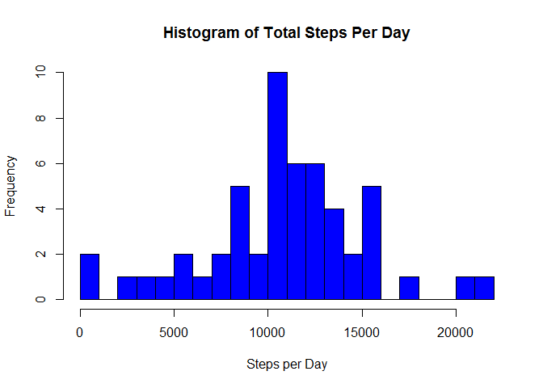
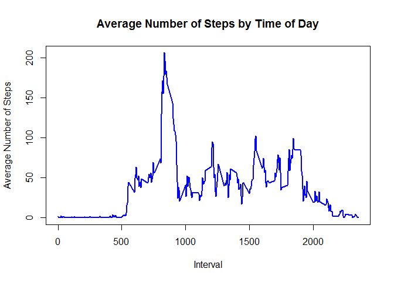
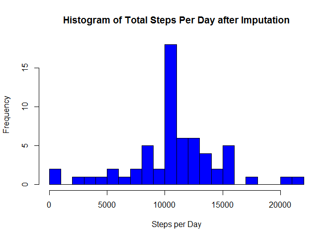
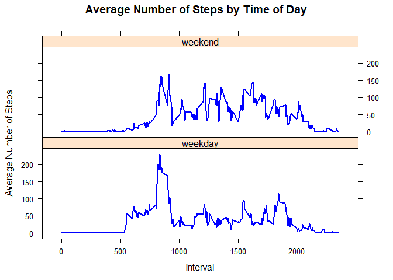

# Peer Assessment 1
Libardo Lopez  
Friday, July 19, 2014  
# Reproducible Research: Peer Assessment 1

This assignment makes use of data from a personal activity monitoring
device. This device collects data at 5 minute intervals through out the
day. The dataset consists of two months of data from an anonymous
individual collected during the months of October and November, 2012
and include the number of steps taken in 5 minute intervals each day.

The original source of this data is:

* Dataset: [Activity monitoring data](https://d396qusza40orc.cloudfront.net/repdata%2Fdata%2Factivity.zip) [52K]

The variables included in this dataset are:

* **steps**: Number of steps taking in a 5-minute interval (missing
    values are coded as `NA`)

* **date**: The date on which the measurement was taken in YYYY-MM-DD
    format

* **interval**: Identifier for the 5-minute interval in which
    measurement was taken

The dataset is stored in a comma-separated-value (CSV) file and contains 
17,568 observations.


```r
library(knitr)
opts_knit$set(fig.keep='high', fig.path='figures/', dev='png',
              warning=FALSE, message=FALSE)
```

## Setting, preprocessing and loading  the data

NOTE: Be sure to have the zip folder in the same working directory; in my case "F:/2014/Coursera/Data Science/RepResearch/Week 2/RR_Week2_Peer1/"; please adjust it as your needs.

Load the dataset from the zip file and convert the string dates to R date-time format.  
Also create totals of steps by day and average of steps by interval.


```r
Sys.setlocale("LC_TIME", "C") #change my local time to english
```

```
## [1] "C"
```

```r
setwd("F:/2014/Coursera/Data Science/RepResearch/Week 2/RR_Week2_Peer1/")
activity <- read.csv(unz(description = "repdata-data-activity.zip", filename = "activity.csv"),stringsAsFactors=FALSE)
```


## What is the mean total number of steps taken per day?

1. Make a histogram of the total number of steps taken each day


```r
steps.date <- aggregate(steps ~ date, data=activity, FUN=sum)
hist(steps.date$steps, xlab="Steps per Day", main="Histogram of Total Steps Per Day", col="blue", breaks=25)
```

 

2. Calculate and report the **mean** and **median** total number of
   steps taken per day

Mean number of steps per day = 1.0766 &times; 10<sup>4</sup>  
Median number of steps per day = 10765

## What is the average daily activity pattern?

1. Make a time series plot (i.e. `type = "l"`) of the 5-minute
   interval (x-axis) and the average number of steps taken, averaged
   across all days (y-axis)


```r
steps.interval <- aggregate(steps ~ interval, data=activity, FUN=mean)
plot(steps.interval, type="l", xlab="Interval", ylab="Average Number of Steps", col = "blue", lwd = 2, main="Average Number of Steps by Time of Day")
```

 

2. Which 5-minute interval, on average across all the days in the
   dataset, contains the maximum number of steps?

The time interval with the maximum average number of steps per day is the 835

## Imputing missing values

1. Calculate and report the total number of missing values in the
   dataset (i.e. the total number of rows with `NA`s)

The total number of missing values is 2304

2. Devise a strategy for filling in all of the missing values in the
   dataset. The strategy does not need to be sophisticated. For
   example, you could use the mean/median for that day, or the mean
   for that 5-minute interval, etc.

I will use the means for the 5-minute intervals as fillers for missing
values.

3. Create a new dataset activityimp that is equal to the original dataset but with the missing data filled in.  


```r
activity <- merge(activity, steps.interval, by="interval", suffixes=c("",".y"))
nas <- is.na(activity$steps)
activity$steps[nas] <- activity$steps.y[nas]
activity <- activity[,c(1:3)]
```

4. Make a histogram of the total number of steps taken each day and
   Calculate and report the **mean** and **median** total number of
   steps taken per day. Do these values differ from the estimates from
   the first part of the assignment? What is the impact of imputing
   missing data on the estimates of the total daily number of steps?


```r
steps.date <- aggregate(steps ~ date, data=activity, FUN=sum)
hist(steps.date$steps, xlab="Steps per Day", main="Histogram of Total Steps Per Day after Imputation", col="blue", breaks=25)
```

 

The total number of missing values is 0 after imputation.  
Mean number of steps per day = 1.0766 &times; 10<sup>4</sup> after imputation.  
Median number of steps per day = 1.0766 &times; 10<sup>4</sup> after imputation.

Because of the imputation method, the mean and median values are similar to those before imputation.  


## Are there differences in activity patterns between weekdays and weekends?

1. Create a new factor variable in the dataset with two levels --
   "weekday" and "weekend" indicating whether a given date is a
   weekday or weekend day.


```r
daytype <- function(date) {
    if (weekdays(as.Date(date)) %in% c("Saturday", "Sunday")) {
        "weekend"
    } else {
        "weekday"
    }
}
activity$daytype <- as.factor(sapply(activity$date, daytype))
```

2. Make a panel plot containing a time series plot (i.e. `type = "l"`)
   of the 5-minute interval (x-axis) and the average number of steps
   taken, averaged across all weekday days or weekend days
   (y-axis).


```r
library(plyr)
activity_WdayInterval <- ddply(activity, .(daytype, interval),
                                  function(x) mean(x$steps))
colnames(activity_WdayInterval)[3] <- "avgSteps"

library(lattice)
xyplot(avgSteps ~ interval | daytype, data=activity_WdayInterval,
       type="l", layout=c(1,2), xlab="Interval", ylab="Average Number of Steps", col = "blue", lwd = 2, main="Average Number of Steps by Time of Day")
```

 

We can not see a big difference in activity patterns.  
On weekdays steps are concentrated in the morning and evening while on weekends steps are decreased in the early morning and sligthly spread out across the remainder of the day.

